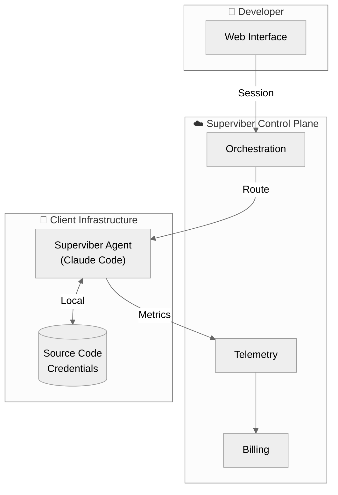

# ADR 0017: Hosted Coding Assistant Architecture

| | |
|---|---|
| **Status** | Accepted |
| **Date** | 2026-01-30 |
| **Derived From** | 6-expert alignment dialogue (100% convergence) |

## Context

Superviber wants to offer a managed coding assistant service to clients with three goals:

1. **Run compute centrally** — Clients connect via thin client, Superviber manages infrastructure
2. **Usage-based billing** — Charge clients for their consumption
3. **Path to custom LLM** — Eventually replace Claude Code with proprietary model

The challenge: maintain data sovereignty (client code/credentials stay secure) while centralizing the service.

## Decision

We adopt a **Hybrid Execution Architecture** where Superviber hosts the control plane but execution happens on client infrastructure.

### Architecture Components

| Component | Location | Responsibility |
|-----------|----------|----------------|
| **Control Plane** | Superviber | Session routing, billing, telemetry, model updates |
| **Execution Agent** | Client | Claude Code execution, file operations, credential access |
| **Web Interface** | User browser | Session initiation, UI rendering |

### Why Hybrid?

The dialogue surfaced a fundamental conflict: **data sovereignty is incompatible with centralized execution**. Claude Code must read files, access credentials, and execute commands. If this happens on Superviber servers, client data leaves client infrastructure.

The hybrid model resolves this:
- **Credentials never leave client** — Agent runs locally with local access
- **Superviber never sees source code** — Only orchestration metadata
- **Client controls revocation** — Uninstall agent = instant termination

## Billing Model

**Tiered Capacity Pricing** (MVP):

| Tier | Price | Concurrent Sessions |
|------|-------|---------------------|
| Small | $500/mo | 2 |
| Medium | $2,000/mo | 10 |
| Enterprise | Negotiated | Unlimited (fair-use) |

This model:
- Provides predictable client budgets
- Avoids token measurement disputes
- Aligns with how clients budget for dev tools (per-seat equivalent)

**Roadmap**: Outcome-based pricing (charge for merged PRs, resolved issues) once measurement infrastructure matures.

## Custom LLM Strategy

**Internal R&D only** — not client-facing.

The dialogue reached consensus that publicly positioning a custom LLM migration path:
- Suppresses willingness to pay premium prices today
- Creates vendor lock-in paradox (building dependency while planning migration)
- Introduces uninsurable liability (model errors, IP contamination)

Instead:
- Build custom LLM quietly as cost optimization
- Maintain Claude Code as premium, Anthropic-backed offering
- Custom LLM becomes deployment target within same orchestration layer (not replacement)

## Compliance Requirements

**Mandatory baseline** regardless of architecture:

| Requirement | Purpose |
|-------------|---------|
| Data Processing Addendum (DPA) | GDPR Article 28 compliance |
| SOC 2 Type II attestation | Enterprise procurement requirement |
| Scope-limited processing | Only orchestration metadata, not client code |
| Encryption in transit (mTLS) | Agent ↔ Control plane communication |
| Standard DPA templates | Accelerate sales (no custom negotiation) |

With hybrid architecture, Superviber processes **orchestration metadata only** (session routing, telemetry aggregation), not client code or credentials. This reduces data classification exposure and simplifies SOC 2 scope.

## Consequences

### Positive

1. **True data sovereignty** — Client code/credentials never leave client infrastructure
2. **Simpler compliance** — Superviber is orchestration processor, not code processor
3. **Predictable billing** — Capacity tiers eliminate runaway cost risk
4. **Clear liability boundaries** — Orchestration SLA with Superviber, execution with client
5. **Custom LLM optionality** — Can swap models without client disruption

### Negative

1. **Client deployment required** — Must install agent in client infrastructure
2. **Agent maintenance** — Superviber pushes updates, client applies them
3. **Network dependency** — Agent requires outbound connectivity to control plane

### Neutral

1. **Custom LLM timeline extended** — Internal R&D only delays market positioning
2. **Outcome-based pricing deferred** — Requires measurement infrastructure not yet built

## Deployment Pattern

The Superviber Agent runs as:
- **Kubernetes**: Containerized sidecar in client clusters
- **Traditional**: systemd service on developer machines or shared servers

Connection model:
- Agent initiates **outbound-only** mTLS websocket to control plane
- Client never opens inbound firewall rules
- Superviber never sees credentials

Resource limits (CPU, memory, concurrent sessions) become the billing primitive.

## Related

- [Spike: Blue MCP Server on Superviber Infrastructure](./../spikes/2026-01-30T1503Z-blue-mcp-server-on-superviber-infrastructure.wip.md)
- [ADR 0014: Alignment Dialogue Agents](./0014-alignment-dialogue-agents.accepted.md)
- [Financial Portfolio Management Publication](../publications/alignment-dialogue-financial-portfolio-management.md)

---

*This ADR was derived from a 6-expert alignment dialogue achieving 100% convergence in 3 rounds.*

*Experts: 🧁 Muffin (Platform Architect), 🧁 Cupcake (Security Engineer), 🧁 Scone (Product Strategist), 🧁 Eclair (Business Analyst), 🧁 Donut (DevOps/SRE), 🧁 Brioche (Legal/Compliance)*
