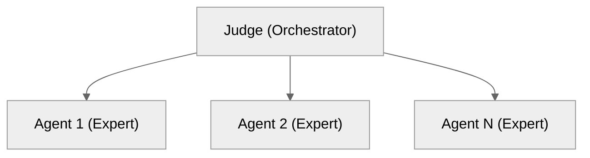

# N+1 Alignment Dialogue Architecture: Technical Specification for Defensive Publication

**Authors:** Eric G. et al.
**Date:** 2026-01-29
**Version:** 1.0
**License:** CC0 1.0 Universal (Public Domain Dedication)

---

## Abstract

This document constitutes a defensive publication establishing prior art for a multi-agent deliberation system architecture. The N+1 Alignment Dialogue Architecture coordinates N parallel large language model (LLM) agents orchestrated by a single Judge agent to achieve convergent consensus through structured deliberation. Key technical innovations include: (1) simultaneous parallel spawning eliminating first-mover bias, (2) file-based state coordination for stateless LLM session management, (3) multi-dimensional unbounded scoring with velocity-based convergence detection, and (4) round-scoped artifact persistence enabling session resumption. This architecture is hereby released to the public domain to prevent patent encumbrance and preserve open development.

---

## 1. Introduction

### 1.1 Purpose

This document serves as a formal defensive publication under established intellectual property practices. By publicly disclosing the complete technical specification with a verifiable timestamp, this publication establishes prior art that:

1. Prevents third parties from obtaining patent protection on the described architecture
2. Preserves freedom to operate for all implementers
3. Enables collaborative development without licensing restrictions

### 1.2 Scope

The architecture described herein applies to any system coordinating multiple LLM agents for deliberative consensus, regardless of:

- Specific LLM provider or model
- Implementation language or framework
- Deployment environment (local, cloud, hybrid)
- Application domain (software design, policy analysis, creative work, etc.)

---

## 2. System Architecture

### 2.1 N+1 Agent Topology

The system comprises N+1 agents in a hub-and-spoke configuration:



**Judge Agent (1):**
- Spawns all N expert agents simultaneously
- Reads and synthesizes expert outputs
- Computes alignment scores across defined dimensions
- Determines convergence based on velocity metrics
- Maintains authoritative state artifacts

**Expert Agents (N):**
- Execute with isolated, independent context windows
- Read shared context artifacts (tensions, prior round summaries)
- Write outputs to dedicated files before acknowledgment
- Operate without awareness of peer outputs within a round

### 2.2 Parallel Spawning Protocol

**Critical Innovation:** All N expert agents are spawned in a single atomic operation to eliminate first-mover bias.

```
PROCEDURE SpawnRound(round_number, agents[]):
    mkdir round-{round_number}/

    FOR EACH agent IN agents DO IN PARALLEL:
        spawn_task(
            agent_id = agent.name,
            context = BuildContext(round_number, agent),
            output_file = round-{round_number}/{agent.name}.md
        )
    END PARALLEL

    AWAIT ALL tasks complete
    RETURN collected_outputs[]
```

**Properties:**
- No agent receives information about peer responses within the same round
- Each agent operates with identical prior-round context
- Eliminates sequential contamination of perspectives
- Enables true independence of viewpoints

### 2.3 Context Isolation Model

Each expert agent receives:

| Round | Context Provided |
|-------|------------------|
| 0 | Topic + grounding documents only |
| N>0 | Topic + grounding + tensions.md + round-(N-1).summary.md + round-(N-1)/*.md |

**Isolation Guarantee:** Within round R, agent A cannot observe agent B's round-R output. Cross-agent visibility occurs only after Judge synthesis.

---

## 3. File-Based State Coordination Protocol

### 3.1 Directory Structure

```
/dialogue-workspace/{dialogue-slug}/
├── scoreboard.md              # Judge writes, agents read
├── tensions.md                # Judge writes, agents read
├── round-0/
│   ├── agent-1.md            # Agent 1 writes, Judge + peers read
│   ├── agent-2.md            # Agent 2 writes, Judge + peers read
│   └── agent-n.md            # Agent N writes, Judge + peers read
├── round-0.summary.md         # Judge writes, agents read
├── round-1/
│   └── ...
└── round-N/
    └── ...
```

### 3.2 Write-Before-Acknowledgment Protocol

**Critical Innovation:** Agents must persist complete output to filesystem before returning acknowledgment to Judge.

```
PROCEDURE AgentExecute(context, output_file):
    response = GenerateResponse(context)

    # MANDATORY: Write to file BEFORE returning
    WriteFile(output_file, response.full_content)

    # Only after successful write, return summary
    RETURN response.summary
```

**Properties:**
- Prevents work loss from context window overflow or session interruption
- Creates durable artifacts for audit and resumption
- Enables Judge to read full content even if agent summary is truncated
- Supports compaction-resilient dialogue continuation

### 3.3 Round-Scoped Artifact Isolation

Each round's outputs are isolated in a dedicated directory:

- **Immutability:** Once written, round-N files are never modified
- **Atomicity:** All agent files for round N exist before round N+1 begins
- **Traceability:** Complete history preserved for analysis

---

## 4. Convergence Detection Mechanism

### 4.1 Multi-Dimensional Scoring

Each agent's contribution is scored across four unbounded dimensions:

| Dimension | Definition |
|-----------|------------|
| **Wisdom** | Quality of insight; depth of understanding demonstrated |
| **Consistency** | Coherence with prior positions; intellectual honesty |
| **Truth** | Accuracy of claims; evidence-based reasoning |
| **Relationships** | Engagement with peers; integration of perspectives |

**ALIGNMENT Score:**
```
ALIGNMENT(agent) = Wisdom + Consistency + Truth + Relationships
```

**Critical Innovation:** Dimensions are unbounded (no maximum). Exceptional contributions can achieve arbitrarily high scores, creating positive-sum dynamics rather than zero-sum competition.

### 4.2 Velocity-Based Convergence

**Definition:** Velocity is the rate of ALIGNMENT change between rounds.

```
Velocity(R) = TotalALIGNMENT(R) - TotalALIGNMENT(R-1)
```

**Convergence Criterion:**
```
CONVERGED = (Velocity ≈ 0) OR (AllTensionsResolved) OR (R >= MaxRounds)
```

**Interpretation:**
- High velocity: Significant new perspectives emerging; continue deliberation
- Low velocity: Diminishing returns; approaching consensus
- Zero velocity: Full convergence achieved

### 4.3 Tension Tracking

Tensions are explicitly tracked data structures:

```
TENSION {
    id: string,           # Unique identifier (T01, T02, ...)
    description: string,  # One-sentence problem statement
    status: enum,         # Open | Converging | Resolved
    raised_by: agent_id,  # Originating agent
    round_raised: int,    # Round number
    round_resolved: int   # Null if unresolved
}
```

**Resolution Mechanisms:**
- `[RESOLVED Tn]` — Agent explicitly marks tension as addressed
- `[CONCESSION: ...]` — Agent yields position, eliminating disagreement
- `[REFINEMENT: ...]` — Agent narrows scope, reducing tension surface

---

## 5. Structured Output Format

### 5.1 Agent Response Schema

```markdown
[PERSPECTIVE P01: brief label]
Two to four sentences stating a novel viewpoint.

[PERSPECTIVE P02: brief label]  # Optional
One to two sentences if genuinely distinct.

[TENSION T01: brief description]  # Optional
One sentence identifying an unresolved issue.

[REFINEMENT: description]  # Optional, Round 1+
[CONCESSION: description]  # Optional, Round 1+
[RESOLVED Tn]              # Optional, Round 1+
```

### 5.2 Return Summary Schema

Agents return a 4-line summary to the Judge:

```
Perspectives: P01 [label], P02 [label]
Tensions: T01 [label]
Moves: CONCESSION | REFINEMENT | RESOLVED | none
Claim: [single strongest claim in one sentence]
```

**Purpose:** Enables Judge to synthesize without reading full files when summaries are sufficient.

---

## 6. Implementation Considerations

### 6.1 LLM Context Window Management

The file-based architecture addresses LLM-specific constraints:

| Constraint | Solution |
|------------|----------|
| Limited context window | Round-scoped files limit per-round context |
| Stateless sessions | File persistence reconstructs state |
| Token limits | Structured format enforces brevity |
| Session interruption | Durable artifacts enable resumption |

### 6.2 Scalability

| N (Experts) | Characteristics |
|-------------|-----------------|
| 3-5 | Focused deliberation; quick convergence |
| 7-9 | Broader perspectives; moderate overhead |
| 11-13 | Comprehensive coverage; higher latency |
| >15 | Diminishing returns; coordination overhead dominates |

**Recommended:** Odd numbers to avoid tie conditions in perspective overlap.

### 6.3 Tier Distribution

For N=12 agents, recommended relevance distribution:

| Tier | Count | Relevance Range | Purpose |
|------|-------|-----------------|---------|
| Core | 4 | 0.75-0.95 | Domain specialists |
| Adjacent | 5 | 0.50-0.70 | Related domains |
| Wildcard | 3 | 0.25-0.45 | Fresh perspectives; prevent groupthink |

---

## 7. Prior Art Context

This architecture builds upon and differentiates from:

| Prior Art | Relationship |
|-----------|--------------|
| Delphi Method (1950s) | Similar iterative expert consensus; differs in parallel execution and scoring |
| Byzantine Fault Tolerance | Similar N-of-M coordination; differs in cooperative vs adversarial model |
| MapReduce (2004) | Similar parallel execution + merge; differs in stateless LLM constraints |
| Multi-Agent Debate (Du et al. 2023) | Similar LLM deliberation; differs in convergence detection and artifact persistence |
| AutoGen/MetaGPT/CrewAI | Similar multi-agent orchestration; differs in file-based state and scoring |

**Novel Combination:** The specific combination of (1) parallel spawning with context isolation, (2) file-based write-before-acknowledgment, (3) unbounded multi-dimensional scoring, and (4) velocity-based convergence detection addresses LLM-specific orchestration challenges not present in prior distributed systems.

---

## 8. Public Domain Dedication

This technical specification is released under CC0 1.0 Universal (Public Domain Dedication).

To the extent possible under law, the authors have waived all copyright and related or neighboring rights to this work. This work is published from the United States.

**No Patent Rights Reserved:** The authors explicitly disclaim any intent to seek patent protection on the architecture described herein and release all described innovations to the public domain.

---

## 9. Document Provenance

**For Verification:**

```
Document: alignment-dialogue-architecture-defensive-publication.md
Date: 2026-01-29
SHA-256: [run: sha256sum <final-filename>]
```

**Recommended Publication Venues:**
- arXiv.org (cs.AI, cs.MA, cs.SE)
- Zenodo.org (with DOI assignment)
- Internet Archive (archive.org)
- Prior Art Archive (priorartarchive.org)

---

## Appendix A: Reference Implementation Pseudocode

```python
class AlignmentDialogue:
    def __init__(self, topic, agents, max_rounds=5):
        self.topic = topic
        self.agents = agents
        self.max_rounds = max_rounds
        self.tensions = []
        self.scores = {a.name: 0 for a in agents}

    def run(self):
        for round_num in range(self.max_rounds):
            # 1. Create round directory
            mkdir(f"round-{round_num}/")

            # 2. Build context for this round
            context = self.build_context(round_num)

            # 3. Spawn ALL agents in parallel (critical)
            outputs = parallel_map(
                lambda agent: self.execute_agent(agent, context, round_num),
                self.agents
            )

            # 4. Score contributions
            self.score_round(outputs, round_num)

            # 5. Write artifacts
            self.write_scoreboard()
            self.write_tensions()
            self.write_summary(round_num)

            # 6. Check convergence
            if self.is_converged(round_num):
                break

        return self.final_synthesis()

    def execute_agent(self, agent, context, round_num):
        output_file = f"round-{round_num}/{agent.name}.md"

        # Agent generates response
        response = agent.generate(context)

        # CRITICAL: Write before acknowledgment
        write_file(output_file, response.full_content)

        return response.summary

    def is_converged(self, round_num):
        if round_num == 0:
            return False

        velocity = self.total_alignment(round_num) - self.total_alignment(round_num - 1)
        all_resolved = all(t.status == "Resolved" for t in self.tensions)

        return velocity < THRESHOLD or all_resolved
```

---

## Appendix B: Deliberation Record

This specification was developed through a 12-expert alignment dialogue that achieved 100% convergence (509 total ALIGNMENT points) over 3 rounds, resolving all 13 raised tensions. The deliberation record is preserved at:

`dialogues/2026-01-29T2121Z-patentability-of-the-alignment-dialogue-game-system.dialogue.recorded.md`

---

*End of Document*
