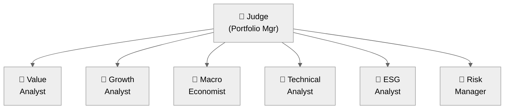
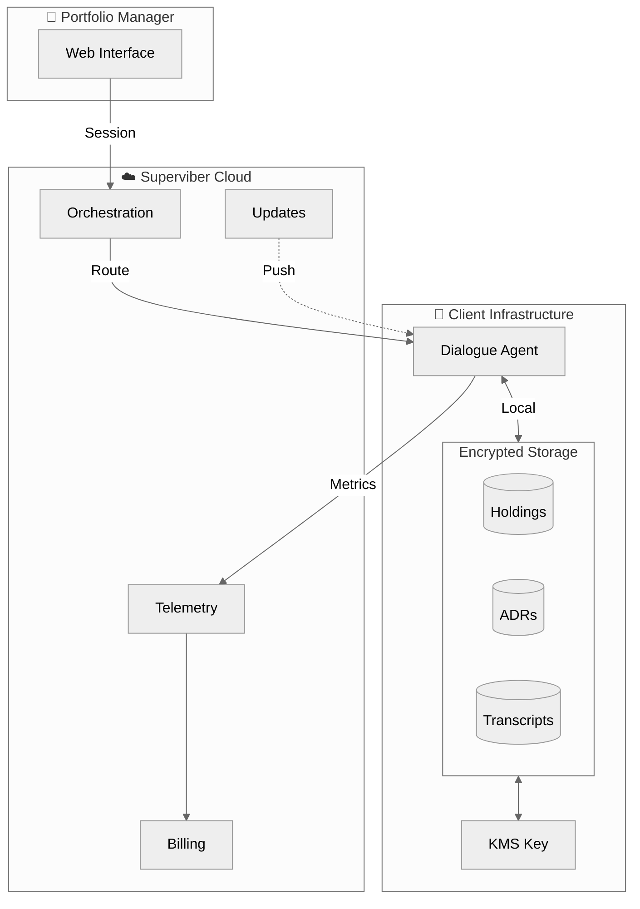
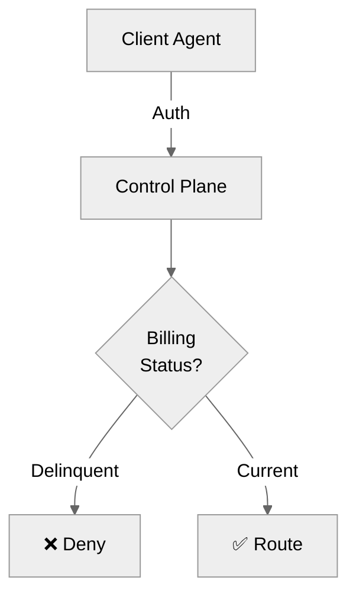

# N+1 Alignment Dialogue for Financial Portfolio Management

| | |
|---|---|
| **Authors** | Eric Garcia et al. |
| **Date** | 2026-01-30 |
| **Version** | 2.1 |
| **Classification** | Client Document (Not for Public Distribution) |
| **Based On** | [N+1 Alignment Dialogue Architecture](https://doi.org/10.5281/zenodo.18434186) (CC0 Public Domain) |

---

## Overview

The N+1 Alignment Dialogue Architecture can be applied to financial portfolio management by treating investment decisions as multi-perspective deliberation problems. Rather than relying on a single model or analyst viewpoint, the system coordinates N expert agents—each representing distinct investment philosophies, asset classes, or analytical frameworks—orchestrated by a Judge agent that synthesizes recommendations aligned with the investor's stated strategy.

## Architecture Applied to Finance



**Expert Agents** might include:
- **Value Analyst**: Focuses on intrinsic value, P/E ratios, margin of safety
- **Growth Analyst**: Prioritizes revenue growth, TAM expansion, market share
- **Macro Economist**: Evaluates interest rates, inflation, sector rotation
- **Technical Analyst**: Identifies momentum, support/resistance, trend signals
- **ESG Analyst**: Screens for environmental, social, governance factors
- **Risk Manager**: Models volatility, correlation, drawdown scenarios
- **Behavioral Analyst**: Identifies market sentiment, fear/greed indicators
- **Quant Strategist**: Factor models, statistical arbitrage signals

## ADRs as Strategy Calibration

**Architecture Decision Records (ADRs)** serve as constitutional documents that define the investment ethos. Before any deliberation begins, all expert agents receive the relevant ADRs as grounding context, ensuring their perspectives remain aligned with the stated philosophy.

### Example ADRs for Different Investment Strategies

#### ADR 0001: Long-Term Value Orientation

```markdown
## Context
We believe markets are efficient in the long run but inefficient in the short term.

## Decision
All investment recommendations must have a minimum 5-year holding horizon.
Short-term volatility is not a valid reason to exit a position.

## Consequences
- Experts should ignore quarterly earnings noise
- Focus on durable competitive advantages
- Accept short-term underperformance for long-term compounding
```

#### ADR 0002: Capital Preservation Priority

```markdown
## Context
Avoiding permanent loss of capital is more important than maximizing returns.

## Decision
No single position may exceed 5% of portfolio.
Cash allocation must remain between 10-30% at all times.

## Consequences
- Concentration risk is explicitly rejected
- Opportunity cost of cash is accepted
- Experts must identify downside scenarios before upside
```

#### ADR 0003: ESG Integration (Non-Negotiable)

```markdown
## Context
We believe sustainable businesses outperform over full market cycles.

## Decision
Fossil fuel extraction, private prisons, and weapons manufacturing
are excluded regardless of valuation.

## Consequences
- Some sectors permanently off-limits
- ESG Analyst has veto power on compliance
- May underperform in certain market regimes (accepted)
```

#### ADR 0004: Income Generation Focus

```markdown
## Context
Portfolio must generate reliable income for distributions.

## Decision
Target 4% annual yield from dividends and interest.
Growth-only positions limited to 20% of portfolio.

## Consequences
- Favors dividend aristocrats, REITs, bonds
- Sacrifices some growth potential for income stability
- Reinvestment vs distribution decisions guided by this target
```

## How ADRs Calibrate Deliberation

When experts deliberate on a specific decision (e.g., "Should we add NVIDIA to the portfolio?"), the ADRs act as constraints:

| Expert | Uncalibrated View | ADR-Calibrated View |
|--------|-------------------|---------------------|
| Growth Analyst | "Strong buy - AI TAM is massive" | "Strong buy, but ADR 0002 limits to 5% max position" |
| Value Analyst | "Overvalued at 60x earnings" | "Per ADR 0001, 5-year DCF still attractive if AI thesis holds" |
| ESG Analyst | "Passes screens, no concerns" | "Approved per ADR 0003" |
| Risk Manager | "High volatility, 40% drawdown possible" | "Per ADR 0002, size position for acceptable loss" |
| Income Analyst | "No dividend yield" | "Per ADR 0004, must offset with income elsewhere" |

The **Judge** then synthesizes: *"Add NVIDIA at 3% position (below 5% limit), funded by trimming growth allocation, with commitment to hold through volatility per ADR 0001. Income target maintained via existing dividend positions."*

## Scoring Dimensions for Finance

The four ALIGNMENT dimensions adapt to financial context:

| Dimension | Financial Interpretation |
|-----------|-------------------------|
| **Wisdom** | Quality of insight; identification of non-obvious risks or opportunities |
| **Consistency** | Alignment with ADR-defined strategy; intellectual honesty about changing views |
| **Truth** | Accuracy of factual claims; evidence-based reasoning with citations |
| **Relationships** | Integration of peer perspectives; acknowledgment of valid counterarguments |

## Convergence in Practice

**Round 0**: Experts independently assess the opportunity
**Round 1**: Experts read peers' views, identify tensions (e.g., "Value vs Growth on valuation")
**Round 2**: Refinements and concessions emerge; position sizing consensus forms
**Round 3**: Final recommendation with explicit ADR compliance mapping

**Convergence achieved when:**
- All ADR constraints satisfied
- Position sizing agreed within tolerance
- Risk scenarios acknowledged and accepted
- Dissenting views recorded but resolution reached

## Benefits of This Approach

1. **Explicit Philosophy**: ADRs make investment beliefs auditable and consistent
2. **Reduced Bias**: No single expert dominates; parallel execution prevents anchoring
3. **Transparent Reasoning**: Full deliberation record shows *why* decisions were made
4. **Strategy Drift Prevention**: ADRs catch recommendations that violate stated ethos
5. **Adaptable Calibration**: Change ADRs to pivot strategy (e.g., add income focus, remove ESG constraints)

## Example Use Cases

- **Family Office**: ADRs encode multi-generational wealth preservation philosophy
- **Endowment**: ADRs balance growth needs with spending policy and ESG mandates
- **Retirement Portfolio**: ADRs shift risk tolerance as time horizon shortens
- **Thematic Fund**: ADRs define sector/theme boundaries and conviction levels

---

## Related Work

This document applies the publicly available N+1 architecture to financial portfolio management. The core technical innovation is defensively published and available under CC0 public domain:

- **[N+1 Alignment Dialogue Architecture: Technical Specification](https://doi.org/10.5281/zenodo.18434186)** — DOI: 10.5281/zenodo.18434186 (CC0 Public Domain)
  - Establishes prior art for parallel agent spawning, file-based state coordination, unbounded ALIGNMENT scoring, and convergence detection
  - This client document demonstrates domain application of that architecture

- [ADR 0017: Hosted Coding Assistant Architecture](../adrs/0017-hosted-coding-assistant-architecture.accepted.md) — Defines the hybrid execution model used in Appendix A

---

## Appendix A: System Architecture & Data Sovereignty

### Hybrid Execution Architecture

The N+1 Alignment Dialogue system uses a **hybrid execution model**: Superviber hosts the control plane (orchestration, billing, telemetry) while all code execution and data access happens on client infrastructure. This ensures data sovereignty while providing a managed service experience.



### What Runs Where

| Component | Location | What It Does |
|-----------|----------|--------------|
| **Control Plane** | Superviber | Routes sessions, tracks usage, pushes updates |
| **Execution Agent** | Client | Runs Claude Code, spawns expert agents, accesses data |
| **Portfolio Data** | Client | Holdings, transactions, performance history |
| **Investment ADRs** | Client | Strategy documents that calibrate expert behavior |
| **Dialogue Transcripts** | Client | Full deliberation records for audit |

### Why This Architecture?

**Data sovereignty requires execution locality.** The Alignment Dialogue system must read portfolio data, access market feeds, and write recommendations. If this execution happened on Superviber servers, client data would leave client infrastructure.

The hybrid model ensures:
- **Portfolio data never leaves client** — Agent runs locally with local access
- **Credentials stay on client** — API keys, database connections, market feeds
- **Superviber sees only metadata** — Session counts, response times, error rates
- **Client controls termination** — Uninstall agent = instant service termination

### Pricing Model

Superviber maintains the LLM provider relationship (Anthropic enterprise account) and bills clients transparently:

| Component | Pricing |
|-----------|---------|
| **LLM Usage** | Anthropic API cost + 5% management fee |
| **Platform Fee** | Per-tier monthly fee (see below) |

**Platform Tiers:**

| Tier | Monthly Fee | Includes |
|------|-------------|----------|
| **Analyst** | $200 | 2 concurrent dialogues, standard support |
| **Team** | $800 | 10 concurrent dialogues, priority support |
| **Enterprise** | Negotiated | Unlimited dialogues, dedicated support |

**How billing works:**
1. Superviber monitors all LLM API calls through the control plane
2. Monthly invoice = Platform fee + (Anthropic tokens × rate) × 1.05
3. Detailed usage breakdown provided (tokens per dialogue, cost attribution)

**Why Superviber pays Anthropic (not client):**
- Simplified onboarding (no client API key setup)
- Volume discounts passed through to clients
- Enables seamless transition to custom LLM

**Custom LLM Roadmap:**
When Superviber's proprietary coding LLM launches, clients can choose:

| Model | Cost | Trade-off |
|-------|------|-----------|
| Claude (Anthropic) | Pass-through + 5% | Premium quality, Anthropic-backed |
| Superviber LLM | ~40-60% cheaper | Cost-optimized, same orchestration |

Clients can switch models per-dialogue or set a default. The hybrid architecture means the model swap is invisible to client infrastructure.

### Secrets Management

All credentials are managed through [Infisical](https://infisical.com/) workspaces **owned by the client**:

```yaml
# Client's Infisical workspace
workspace: acme-family-office-prod
environments:
  - production

secrets:
  # LLM API keys provided by Superviber (not stored here)
  BLOOMBERG_API_KEY:    # Client's market data feed
  CUSTODIAN_API_KEY:    # Client's brokerage connection
  DATABASE_URL:         # Client's portfolio database
```

**Client controls:**
- Which secrets Superviber agent can access
- Credential rotation schedule
- Instant revocation by removing workspace membership
- Full audit log of every secret access

### Encryption Architecture

#### Data at Rest

All client data is encrypted using keys the client controls:

| Data Type | Encryption | Key Ownership |
|-----------|------------|---------------|
| Portfolio holdings | AES-256-GCM | Client KMS |
| Investment ADRs | AES-256-GCM | Client KMS |
| Dialogue transcripts | AES-256-GCM | Client KMS |
| Expert scores | AES-256-GCM | Client KMS |

Superviber **never has access** to client KMS keys. Data is decrypted only within the client-hosted agent.

#### Data in Flight

| Connection | Encryption | What Traverses |
|------------|------------|----------------|
| User ↔ Control Plane | TLS 1.3 | Session requests, UI |
| Control Plane ↔ Agent | mTLS | Routing, telemetry |
| Agent ↔ LLM API | TLS 1.3 | Prompts, completions |
| Agent ↔ Client Data | Local | Never leaves client |

### Access Revocation

Clients can terminate Superviber access instantly:

| Method | Effect | Time to Termination |
|--------|--------|---------------------|
| Uninstall agent | All service stops | Immediate |
| Remove Infisical membership | Agent loses credentials | < 1 minute |
| Network block outbound | Agent can't reach control plane | Immediate |

No IAM cross-account roles are required. The agent runs as a normal process/container on client infrastructure with client-granted permissions only.

### Service Suspension

Superviber can suspend service if a client account becomes delinquent. The control plane is the gatekeeper—the agent cannot function without it.



**What the agent needs from the control plane:**

| Capability | Without Control Plane |
|------------|----------------------|
| Session routing | Agent doesn't know what to do |
| Authentication | Requests rejected |
| LLM API access | Keys not provided |
| Updates | Agent becomes stale |

**Suspension process:**
1. Invoice overdue → Grace period (configurable, e.g., 15 days)
2. Grace period expires → Account marked delinquent
3. Control plane rejects agent authentication
4. Agent sits idle; client sees "Account suspended" in UI
5. Payment received → Service restored immediately

**No remote access required.** Superviber doesn't need to touch client infrastructure. The agent simply cannot operate without control plane authorization.

**Client data remains safe.** Suspension doesn't affect data on client infrastructure—it just stops new dialogues from running.

### Compliance Posture

| Standard | How Supported |
|----------|---------------|
| **SOC 2 Type II** | Superviber attests to control plane security; client data never touches it |
| **GDPR** | Client is data controller; Superviber is processor of metadata only |
| **SEC Rule 206(4)-7** | ADRs provide auditable compliance framework for investment decisions |
| **FINRA 4370** | All deliberation records retained on client infrastructure |
| **DPA** | Standard Data Processing Addendum covers orchestration metadata |

### Data Sovereignty Summary

| Guarantee | How Achieved |
|-----------|--------------|
| Portfolio data stays on client | Execution agent runs on client infrastructure |
| Client controls encryption | KMS keys never leave client account |
| Client can revoke instantly | Uninstall agent or revoke Infisical access |
| No client data on Superviber | Only session metadata (counts, timing) transmitted |
| Full audit trail | Agent logs stored on client infrastructure |
| Transparent costs | Pass-through LLM pricing + 5%, detailed usage reports |

**The client is always in control. The architecture enforces this—it's not just a promise.**

---

## Appendix B: Getting Started

### 1. Sign Agreement
Contact Superviber to select tier and sign service agreement with DPA.

### 2. Set Up Infisical Workspace
Create workspace, add your API keys and credentials, invite Superviber service account (read-only).

### 3. Deploy Agent
```bash
# Kubernetes
helm install superviber-agent superviber/agent \
  --set infisical.workspace=your-workspace-id

# Docker
docker run -d superviber/agent \
  -e INFISICAL_WORKSPACE=your-workspace-id

# systemd (Linux)
curl -sSL https://get.superviber.com/agent | sudo bash
```

### 4. Connect & Verify
Open web interface, authenticate, verify agent connectivity.

### 5. Define Investment ADRs
Create ADR documents defining your investment philosophy. These calibrate how expert agents deliberate.

### 6. Run First Dialogue
Ask a portfolio question ("Should we add NVIDIA?") and watch experts deliberate to convergent recommendation.
