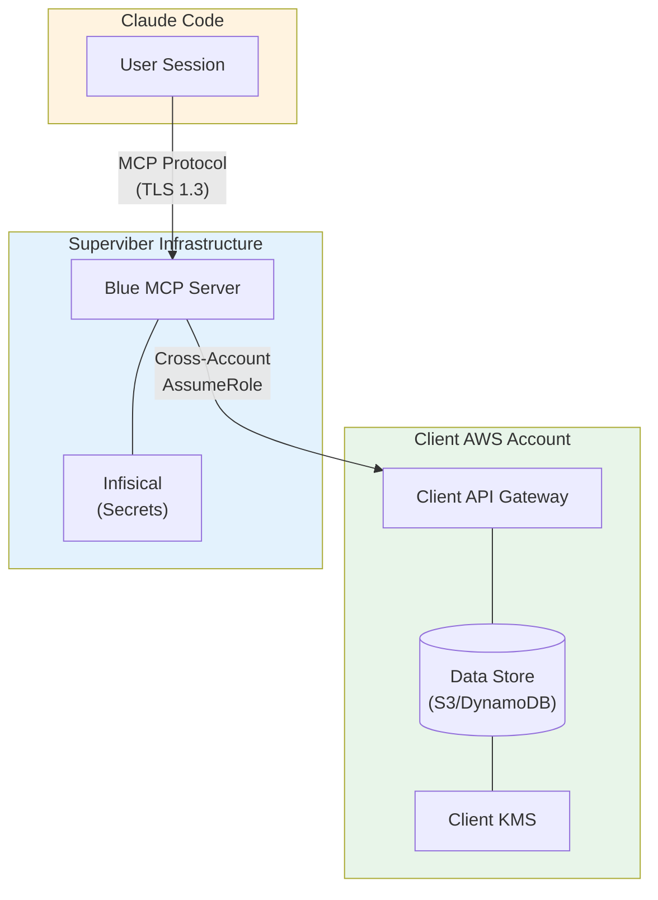
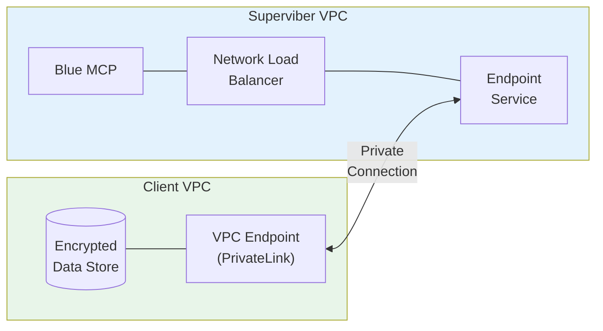
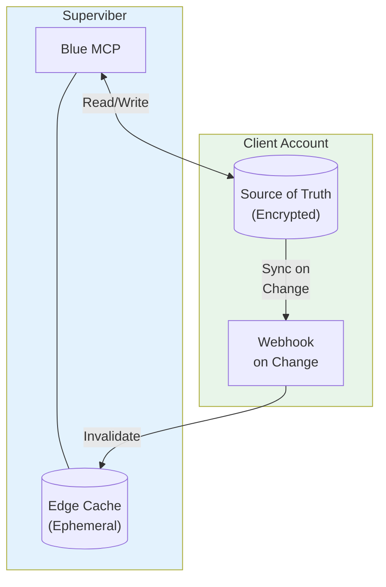
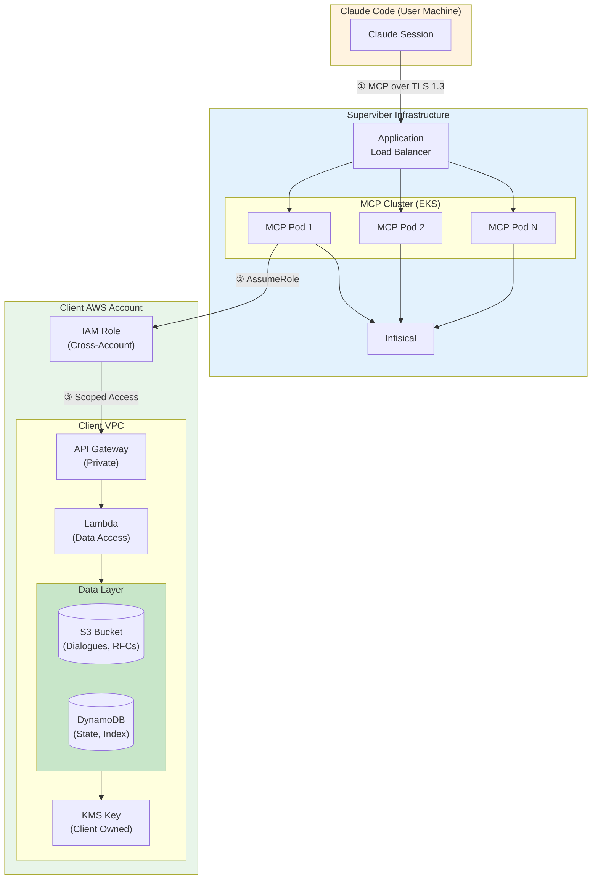
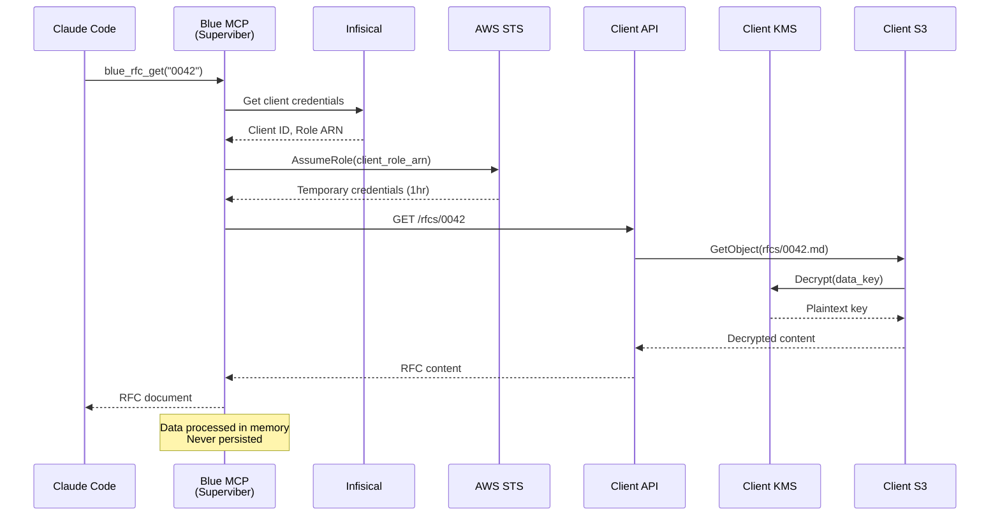
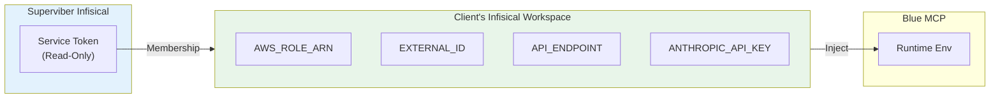
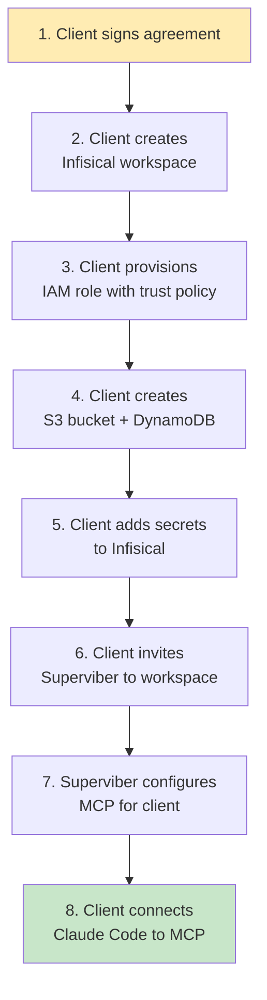

# Spike: Blue MCP Server on Superviber Infrastructure

| | |
|---|---|
| **Status** | In Progress |
| **Date** | 2026-01-30 |
| **Time Box** | 1 hour |

---

## Question

How can we run the Blue MCP server on Superviber infrastructure while maintaining client data sovereignty, encryption, and revocable access?

---

## Context

The current architecture (Appendix A of the financial portfolio doc) assumes Blue MCP runs in the client's AWS account. However, running MCP on Superviber infrastructure offers benefits:

- **Simpler client onboarding**: No deployment required in client account
- **Centralized updates**: Push new features without client coordination
- **Operational visibility**: Better observability and debugging
- **Cost efficiency**: Shared infrastructure across clients

The challenge: maintain data sovereignty guarantees while centralizing compute.

---

## Architecture Options

### Option A: Proxy Model with Client Data Store

MCP server on Superviber infra acts as stateless compute. All persistent data remains on client infrastructure, accessed via secure API.



**Data Flow:**
1. Claude Code connects to Blue MCP on Superviber infra
2. MCP assumes cross-account role to access client API
3. Client API reads/writes to encrypted data store
4. Data encrypted by client KMS - MCP never sees plaintext keys
5. MCP processes in memory, never persists client data

### Option B: PrivateLink Model

AWS PrivateLink provides private connectivity without traversing public internet.



**Pros:** Traffic never leaves AWS backbone, lower latency
**Cons:** More complex setup, per-client PrivateLink costs

### Option C: Hybrid with Edge Cache

MCP runs on Superviber with optional edge caching for read-heavy ADR/RFC data.



**Pros:** Better performance for read-heavy workloads
**Cons:** Cache adds complexity, eventual consistency

---

## Recommended Architecture: Option A (Proxy Model)

The proxy model is simplest and maintains strongest data sovereignty guarantees.

### Detailed Architecture



### Request Flow



### Access Control Matrix

| Resource | Superviber Access | Client Control |
|----------|-------------------|----------------|
| Blue MCP Server | Owns & operates | N/A |
| Client API Gateway | Invoke via role | Creates/deletes endpoint |
| Client S3 Bucket | Read/write via role | Owns bucket, sets policy |
| Client DynamoDB | Read/write via role | Owns table, sets policy |
| Client KMS Key | **No access** | Full control |
| Infisical Secrets | Read (membership) | Owns workspace, can revoke |
| IAM Cross-Account Role | AssumeRole | Creates/deletes role |

### Client IAM Role Policy

```json
{
  "Version": "2012-10-17",
  "Statement": [
    {
      "Sid": "AllowBlueMCPAccess",
      "Effect": "Allow",
      "Action": [
        "s3:GetObject",
        "s3:PutObject",
        "s3:ListBucket"
      ],
      "Resource": [
        "arn:aws:s3:::client-blue-data",
        "arn:aws:s3:::client-blue-data/*"
      ]
    },
    {
      "Sid": "AllowDynamoDBAccess",
      "Effect": "Allow",
      "Action": [
        "dynamodb:GetItem",
        "dynamodb:PutItem",
        "dynamodb:Query",
        "dynamodb:UpdateItem"
      ],
      "Resource": "arn:aws:dynamodb:*:*:table/blue-*"
    },
    {
      "Sid": "DenyKMSAccess",
      "Effect": "Deny",
      "Action": "kms:*",
      "Resource": "*"
    }
  ]
}
```

**Key point:** The `DenyKMSAccess` statement ensures Superviber can never access encryption keys directly. S3 and DynamoDB use envelope encryption - they decrypt data using the KMS key, but the key itself never leaves KMS.

### Trust Policy (Client Creates)

```json
{
  "Version": "2012-10-17",
  "Statement": [
    {
      "Effect": "Allow",
      "Principal": {
        "AWS": "arn:aws:iam::SUPERVIBER_ACCOUNT_ID:role/BlueMCPServiceRole"
      },
      "Action": "sts:AssumeRole",
      "Condition": {
        "StringEquals": {
          "sts:ExternalId": "${client_external_id}"
        }
      }
    }
  ]
}
```

**Revocation:** Client removes or modifies this trust policy → immediate access termination.

---

## Infisical Integration



**Client onboarding:**
1. Client creates Infisical workspace
2. Client adds required secrets (role ARN, endpoint, etc.)
3. Client invites Superviber service account (read-only)
4. Client can revoke by removing membership

---

## Data Sovereignty Guarantees (Updated)

| Guarantee | Previous (Client Infra) | New (Superviber Infra) |
|-----------|-------------------------|------------------------|
| Data at rest | Client S3/KMS | Client S3/KMS (unchanged) |
| Data in flight | TLS 1.3 | TLS 1.3 (unchanged) |
| Encryption keys | Client KMS | Client KMS (unchanged) |
| Compute location | Client account | Superviber account |
| Data in memory | Client account | Superviber account (ephemeral) |
| Revocation | IAM + Infisical | IAM + Infisical (unchanged) |
| Audit trail | Client CloudTrail | Client CloudTrail + Superviber logs |

**New consideration:** Data passes through Superviber memory during processing. Mitigations:
- No persistence - data only held during request lifecycle
- Memory encryption at rest (EKS with encrypted nodes)
- SOC 2 attestation for Superviber infrastructure
- Option for dedicated/isolated compute per client

---

## Client Onboarding Flow



**Estimated onboarding time:** 30 minutes with Terraform/CDK templates provided.

---

## Open Questions

1. **Multi-tenancy:** Single MCP cluster serving all clients, or isolated per client?
   - Single cluster: Cost efficient, simpler ops
   - Isolated: Stronger security boundary, client preference for finance

2. **Latency:** Cross-account API calls add ~50-100ms per request. Acceptable?
   - Most MCP operations are not latency-sensitive
   - Dialogue runs are already async

3. **Compliance:** Does data-in-memory on Superviber infra affect client's compliance posture?
   - May need to add SOC 2 Type II for Superviber
   - Some clients may still require fully client-hosted

4. **Failover:** If Superviber MCP is down, clients have no access
   - Consider multi-region deployment
   - Or provide fallback to client-hosted MCP

---

## Recommendation

Proceed with **Option A (Proxy Model)** with the following implementation:

1. Deploy Blue MCP on EKS in Superviber AWS account
2. Use Infisical for per-client credential management
3. Provide Terraform/CDK module for client-side infrastructure
4. Offer "dedicated compute" tier for compliance-sensitive clients
5. Document the memory-processing caveat in security docs

**Next steps:**
- [ ] Create RFC for this architecture
- [ ] Build Terraform module for client infrastructure
- [ ] Add multi-tenant support to Blue MCP
- [ ] Draft updated security/compliance documentation

---

*Investigation by Blue*
