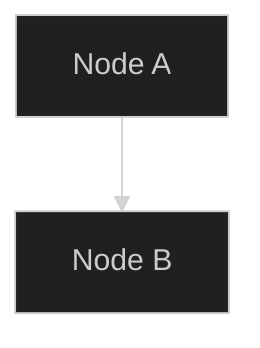
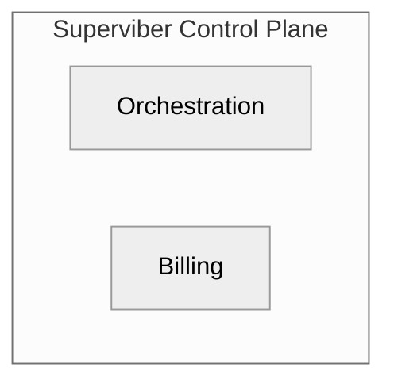
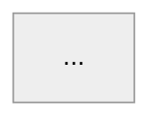
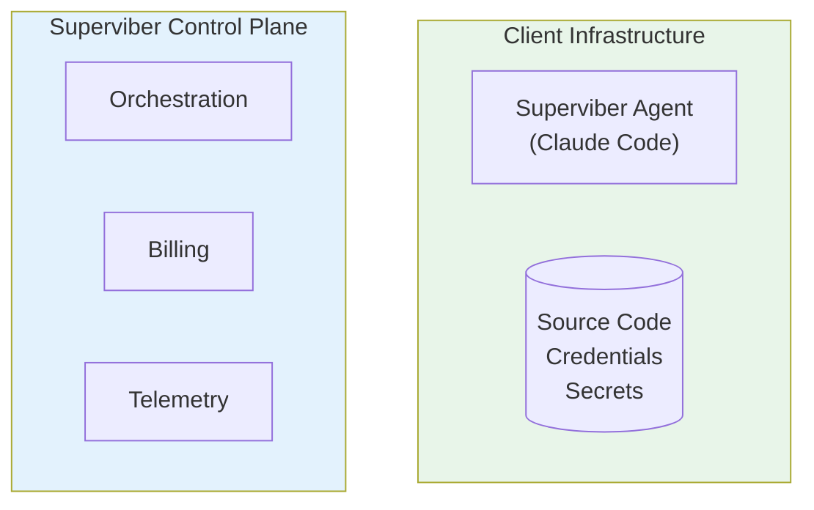
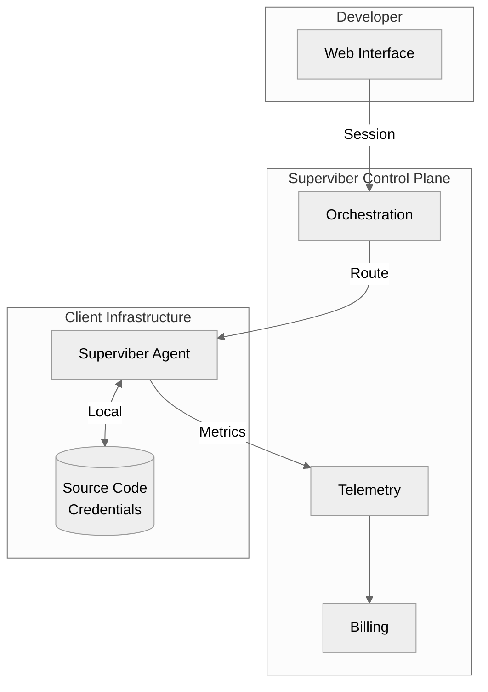

# Spike: Mermaid Diagram Style Guide for Blue Documents

| | |
|---|---|
| **Status** | Done |
| **Date** | 2026-01-30 |
| **Time Box** | 30 minutes |

---

## Question

How can we ensure Mermaid diagrams in Blue documents are readable in both light and dark modes, prefer vertical flow, and have consistent styling?

---

## Problem Analysis

From the screenshot, the current diagram has these issues:

1. **Subgraph labels unreadable** — "Superviber Control Plane" and "Client Infrastructure" use dark text on colored backgrounds
2. **Fill colors designed for light mode** — `#e8f5e9`, `#e3f2fd`, `#fff3e0` are light pastels that look washed out in dark mode
3. **Node text invisible** — Dark nodes (`#333`) have no explicit text color
4. **Horizontal sprawl** — Some diagrams use `LR` when `TB` would be more readable

## Mermaid Theme Options

### Option A: Use `dark` Theme



**Problem**: Still doesn't control subgraph label colors well.

### Option B: Use `base` Theme with Custom Variables

```mermaid
%%{init: {
  'theme': 'base',
  'themeVariables': {
    'primaryColor': '#4a5568',
    'primaryTextColor': '#fff',
    'primaryBorderColor': '#718096',
    'lineColor': '#718096',
    'secondaryColor': '#2d3748',
    'tertiaryColor': '#1a202c'
  }
}}%%
```

**Problem**: Verbose, must repeat in every diagram.

### Option C: Use `neutral` Theme (Recommended)



**Benefit**: Works in both light and dark modes. Grayscale palette avoids color contrast issues.

---

## Recommended Style Guide

### 1. Always Use `neutral` Theme



### 2. Prefer Top-to-Bottom Flow (`TB`)

```mermaid
flowchart TB    ← vertical flow
```

Not:
```mermaid
flowchart LR    ← horizontal, requires scrolling
```

### 3. Avoid Custom Fill Colors

**Don't do this:**
```mermaid
style CLIENT fill:#e8f5e9
```

**Do this instead:**
```mermaid
%% Let neutral theme handle colors
%% Use node shapes for visual distinction
```

### 4. Use Subgraph Labels Without Styling

```mermaid
subgraph CLIENT["Client Infrastructure"]
    %% No style directive needed
end
```

### 5. Use Shape Variations for Distinction

| Shape | Syntax | Use Case |
|-------|--------|----------|
| Rectangle | `[text]` | Services, components |
| Rounded | `(text)` | User-facing elements |
| Database | `[(text)]` | Data stores |
| Stadium | `([text])` | External systems |
| Hexagon | `{{text}}` | Decision points |

### 6. Keep Edge Labels Short

```mermaid
A -->|"mTLS"| B    ← good
A -->|"Mutual TLS encrypted connection over port 443"| B    ← too long
```

---

## Example: ADR 0017 Diagram Rewritten

### Before (problematic)



### After (neutral theme, readable)



---

## Implementation Options

### Option 1: Style Guide Only (Documentation)

Add to `.blue/docs/style-guide.md`:
- Always use `%%{init: {'theme': 'neutral'}}%%`
- Prefer `flowchart TB`
- Avoid custom `style` directives

**Pros**: Simple, no tooling
**Cons**: Relies on authors remembering

### Option 2: Lint Rule

Add to `blue_lint`:
```rust
// Check for Mermaid blocks missing neutral theme
if mermaid_block && !contains("theme': 'neutral'") {
    warn("Mermaid diagram should use neutral theme for dark mode compatibility")
}
```

**Pros**: Automated enforcement
**Cons**: Requires implementation

### Option 3: Pre-render with Consistent Theme

Use `mmdc` CLI to pre-render all Mermaid to SVG/PNG with fixed theme at build time.

**Pros**: Guaranteed consistency
**Cons**: Loses live preview in editors

---

## Decision

**Chosen approach**: Option C (`neutral` theme) + Option 2 (Lint rule)

### Why `neutral` Theme

- Works in both light and dark modes without customization
- Grayscale palette avoids color contrast issues
- No need to repeat verbose `themeVariables` in every diagram
- Subgraph labels are readable by default

### Lint Rule Specification

Add to `blue_lint`:

```rust
/// Checks Mermaid code blocks for neutral theme declaration
fn lint_mermaid_theme(content: &str) -> Vec<LintWarning> {
    let mut warnings = vec![];

    // Find all mermaid code blocks
    for (line_num, block) in find_mermaid_blocks(content) {
        if !block.contains("'theme': 'neutral'") && !block.contains("\"theme\": \"neutral\"") {
            warnings.push(LintWarning {
                line: line_num,
                message: "Mermaid diagram should use neutral theme: %%{init: {'theme': 'neutral'}}%%".into(),
                severity: Severity::Warning,
            });
        }
    }

    warnings
}
```

### Implementation Tasks

1. ✅ **Document decision** — This spike
2. ⬜ **Update ADR 0017** — Apply neutral theme to diagram
3. ⬜ **Add lint rule** — Implement in `blue_lint` crate
4. ⬜ **Create style guide** — Add `.blue/docs/mermaid-style-guide.md`

---

## Quick Reference Card

```markdown
## Blue Mermaid Cheatsheet

Always start with:
​```mermaid
%%{init: {'theme': 'neutral'}}%%
flowchart TB
​```

Shapes:
- [Rectangle] — services
- (Rounded) — user-facing
- [(Database)] — data stores
- {{Hexagon}} — decisions

Don't use:
- style X fill:#color
- flowchart LR (prefer TB)
- Long edge labels
```

---

*Investigation by Blue*
